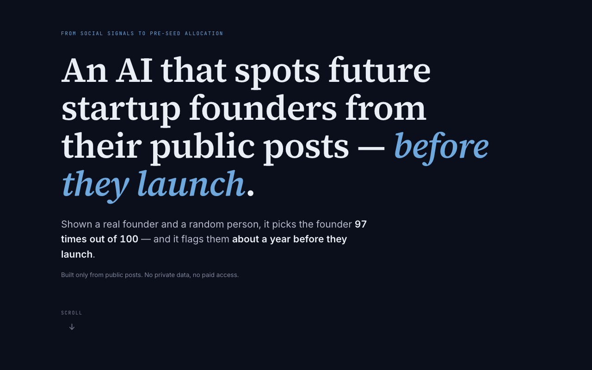

<div align="center">

# 📡 Founder Radar

### An AI that spots future startup founders from their public posts — *before they launch.*

**[▶︎ Try the live demo](https://founder-radar-ai.vercel.app)**

<a href="https://founder-radar-ai.vercel.app">
  
</a>

*Shown a real founder and a random person, it picks the founder **97 times out of 100** —
and it flags them a median of **~12 months before they launch** (one of them 44 months early).*

Built for the EDHEC International BBA thesis
***From Social Signals to Pre-Seed Allocation*** · Kristian Ratkov · supervised by Prof. George Tovstiga

</div>

---

## The idea in one paragraph

Pre-seed VC is relationship-driven: if a founder isn't in the right network, nobody is looking at them at exactly the stage where capital is cheapest. But founders **leave a public trail before they launch** — they build in public, state their goals out loud, and pull people toward them. This project reads that trail (Hacker News posts, archived tweets, Product Hunt, free public data only), scores ~30 behavioural sub-signals per post with an LLM, and asks one falsifiable question: **can you tell who becomes a founder, before they do?**

## Headline results (n = 139, leave-one-out CV)

| What we measured | Result |
|---|---|
| Separating future founders from in-niche peers | **ROC-AUC 0.967** (95% CI [0.913, 0.996]) |
| Ranking quality | PR-AUC 0.905 · **lift@5 = 6.6×** over the 11.7% base rate |
| Pre-emergence lead (the "time machine") | median **+12 months**, max **+44** across 8 founders with deep history |
| Named early catches | Ben Tossell **~44 mo**, Noah Bragg **~28 mo**, Daniel Vassallo **~21 mo**, Packy McCormick **~11 mo** before launch |

**And two honest nulls, reported straight** (a backtest you can't fail isn't worth running):

- The **knowledge-graph layer added nothing** (ΔROC-AUC −0.002) — free public data exposes *what people post*, not *who they know*, so the graph had no person-to-person edges to exploit.
- The two-tier ranking composite **did not beat a "who posts most" heuristic** (precision@5 0.50 vs 0.73). The system's real edge is the *early flag*, not top-of-list ordering.

Every number above traces to a CSV in `data/processed/` and to the thesis (§VI). Predictions for the *future* were locked and hashed on **31 May 2026**, before outcomes are known — so the framework can be checked, not just believed.

## How it works

```
 ~36 named founders + 273 in-niche peers (anonymous)
        │
        ▼
┌──────────────────┐   free public sources only: Hacker News, Wayback-archived
│  ingestion/      │   tweets, Product Hunt, YouTube, Google Trends. Every fetch
│  (collectors)    │   SHA-256-archived for reproducibility. No paid APIs.
└────────┬─────────┘
         ▼
┌──────────────────┐   Claude Haiku scores each post against a 6-family,
│  scoring/        │   ~30-sub-signal taxonomy (build-in-public, expressed
│  (LLM taxonomy)  │   intention, network pull, …). Cost-ledgered per call.
└────────┬─────────┘
         ▼
┌──────────────────┐   per-person features → logistic model → backtest with a
│  analysis/ +     │   sacred rule: a score at date T may only use signals
│  models/         │   from BEFORE T (lookahead-bias guards + tests).
└────────┬─────────┘
         ▼
┌──────────────────┐   the monthly replay: when was each person first flagged,
│  the Time Machine│   when did they actually launch, and how big was the
│  (frontend/)     │   head-start? → founder-radar-ai.vercel.app
└──────────────────┘
```

## Repository map

| Path | What lives there |
|---|---|
| `frontend/` | The live site (Next.js) — single-scroll story + the interactive Time Machine, cold-loads from one static JSON, no server |
| `ingestion/` | Source collectors (HN, Wayback/X, Reddit, Product Hunt, YouTube, Trends) + SHA-256 raw archive |
| `scoring/` | LLM signal scoring — idempotent, budget-guarded, cost-ledgered (`data/interim/llm_run_log.jsonl`) |
| `analysis/` | Person features, knowledge graph, topic momentum, **`discovery_timeline.py`** (the time machine math) |
| `models/` | Baseline + KG-augmented models, evaluation with bootstrap CIs, multi-date backtest, Monte Carlo |
| `scripts/` | Pipeline drivers: `run_downstream.py` (one-shot E→I), `export_frontend_timeline.py` (the site's data bundle), `export_for_thesis.py` (figures + results hand-off) |
| `prompts/` | Versioned LLM prompts (the scoring taxonomy) |
| `tests/` | 291 tests incl. `test_integrity.py` — lookahead-leak poison tests, label-leak guards, dedup invariants |
| `docs/superpowers/specs/` | Design specs (landing page, score-anyone feasibility) |
| `data/` | raw / interim / processed — **gitignored, never committed** |

## Running it yourself

```bash
# 0. setup
cp .env.example .env          # add ANTHROPIC_API_KEY (+ optional source keys)
uv sync                       # or: pip install -e .[dev]

# 1. the full downstream pipeline on existing scored data (features → eval →
#    backtest → time machine → frontend bundle → thesis figures)
python -m scripts.run_downstream

# 2. the website
cd frontend && npm install && npm run dev    # → http://localhost:3000

# 3. tests
python -m pytest -q                          # 291 pass
cd frontend && npx tsx scripts/smoke_landing.mts
```

Re-collecting and re-scoring from scratch needs API keys and a small LLM budget (the whole study cost **< $20** in API calls — the ledger is in the repo's run log format).

## Integrity, the boring superpower

- **Lookahead discipline:** every score at date T uses only signals timestamped before T — enforced in code and by poison tests (`tests/test_integrity.py`) that inject future signals and assert nothing changes.
- **No fabrication:** if a source returns nothing for a person, the pipeline records an empty result with the reason. The site shows real posts or says "limited public data" — never invented content.
- **Locked predictions:** the 31 May 2026 prospective picks are a fixed, dated artefact; this repo's backtest is the retrospective complement.
- **Honest nulls on the front page:** the two failed engineering bets are described on the public site itself, in plain words.

## Limitations (the short version)

Small, selection-biased cohort (well-documented, Western, English-language founders); negatives labelled by absence of public milestones; free sources don't reach far enough back for pre-2015 emergences (shown honestly as "data starts late" in the demo); results are a **proof of concept at the individual, pre-launch, creator-economy intersection** — not a returns claim. Full discussion: thesis §IX.

## License

MIT for code · CC-BY 4.0 for non-code artefacts (taxonomy, prompts, schema).

---

<div align="center">

**[founder-radar-ai.vercel.app](https://founder-radar-ai.vercel.app)** — send it to someone who thinks spreadsheets can't be exciting.

</div>
